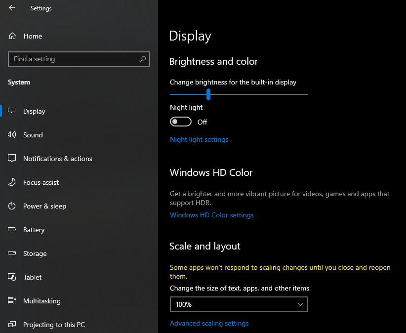

# Bad Apple in terminal using Python

I have accidentally stumbled upon a GitHub profile of my dear friend, [Koteikar](https://github.com/Koteikar). Purely for fun,
I decided to make a fork of his project and make my own thing based on this [VIDEO](https://youtu.be/oh0RQ_TgDnQ?si=SK5zS0XawRZSfmOp).
Also, please check the original work of my friend here -> [Repository](https://github.com/Koteikar/Bad-Apple),
as well as his [VIDEO](https://youtu.be/ikyKLfB4cfg) on YouTube.


## Getting Started

### Prerequisites

For this project you'll need to install these packages:
* opencv-python
* fpstimer
* playsound

### Installing packages

To install these packages you need to write these commands in console:

```
pip install opencv-python
```
```
pip install fpstimer
```
```
pip install playsound==1.2.2
```
Alternatively you can set your terminal to the directory of this repository and simply paste this:
```
pip install -r requirements.txt
```


## Size of a window

The code supports any size of a window, but if you want to run it in full screen,
make sure that the size of a text is set to 100%, or image WILL be asymmetric.
To check the size of the text you need to go to settings > system > display > change the size of text. 


### Running this code

To run this code print in terminal:
```
python main.py
```
If you run the code for the first time, you need to type 'Y' when the code ask you wether to create frames.

## Built With

* [Python 3.9.6](https://www.python.org/)
* [opencv-python](https://opencv.org/)
* [fpstimer](https://pypi.org/project/fpstimer/)
* [playsound](https://pypi.org/project/playsound/)


## Authors

* **Andrew Danylyshyn** - *Initial work* - [Koteikar](https://github.com/Koteikar)
* **Oleh Mruchko** - *Double buffering, FPS control* [olezhkoistaken](https://github.com/olezhkoistaken)


## Acknowledgments from original creator

I'm extremely grateful to ZEN, for creating of Touhou.

I must also thank [あにら](https://www.nicovideo.jp/watch/sm8628149), for creating of video.

## Acknowledgments from Mruchko

I`m extremely grateful to my friend [Koteikar](https://github.com/Koteikar), one of the best.

I must also thank the creator of the video used in this project - [taisynara](https://www.youtube.com/@taisynara),
[NBSPLV](https://www.instagram.com/nbsplv/) for the song, [Inoitoh](https://x.com/inoitoh) for art
and Tatsuki Fujimoto for creating Chainsaw Man.
